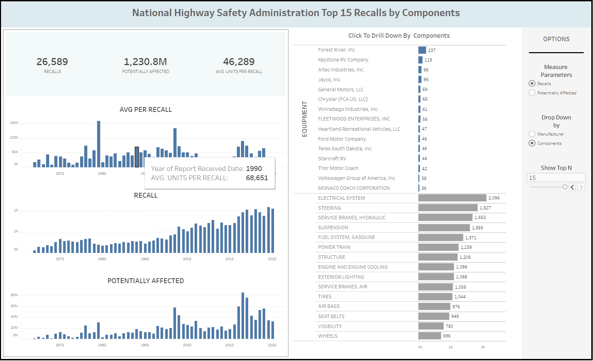

## Data Portfolio
---

### Data Analytics with Python

<b>Digital Bank Service Positional Mapping</b>
  Mapping offered service positiong among digital bank brands in Indonesia using NLP, Jaccard Similarity, Binomial Proportion Test,
and Principal Component Analysis. The position map is deployed using Heroku server to ease user in interpreting the model result 
- [Presentation for the research project](/pdf/bank_service.pdf)

<b>Employee Turnover Prediction</b>
  Predicting employee resignation with Random Forest Classifier, Decision Tree Classifier, Light GBM Classifier, and XGBoost Classifier. Process covered: data exploration, missing value treatment, imbalance treatment, grid search, k-fold validation. 
- [Notebook](/code/turnover_rate.ipynb)

<b>E-commerce EDA</b>
 E-commerce data are explored to gained insights and provide recommendation. Include clustering models based on customer RFM to group customers based on their Customer Lifetime Value 
- [Presentation](/pdf/ecommerce_eda.pdf)
- [Python Notebook](/code/ecommerce_eda.ipynb)
- [Dataset source](https://www.kaggle.com/datasets/carrie1/ecommerce-data)

<b>Students Performance EDA</b>
 Students data are explored to gained insights and provide recommendation 
- [Presentation](/pdf/students_performance.pdf)
- [Python Notebook](/code/students_performance.ipynb)
- [Dataset source](https://www.kaggle.com/datasets/spscientist/students-performance-in-exams)

<b>Female Daily Review Extraction</b>
 Reviews are extracted using Python, specifically using BeautifulSoup package. The extracted reviews are cleaned first using several
Python Function and Regular Expression (RegEx), resulting a ready-to-use data 
for further analysis, like sentiment analysis or topic modelling. 
- [Python Notebook](https://github.com/divawanisa/divawanisa.github.io/blob/master/dataextraction/Female_daily_extraction.ipynb)
- [CSV file for the extracted and cleaned data](https://github.com/divawanisa/divawanisa.github.io/blob/master/dataextraction/data_ekstraksi_clean.csv)

---

### Data Analytics with SQL
<b>[Parch & Posey Data Exploration](https://github.com/divawanisa/divawanisa.github.io/tree/master/parchandposey)</b>
 Parch and Posey is a fictional poster store and required data analyst to provide insight using SQL queries. 
The data and problem questions are sampled from Github Profile "ptyadana" but I made the all the SQL answers.
I used <b>Microsoft SQL server 2019</b> to write and process the SQL Queries.
- [Short EDA for Parch and Posey](pdf/parch_posey_eda.pdf)
 

---

### Data Analytics with Tableau
<b>[Olist marketing Dashboard](https://public.tableau.com/app/profile/diva2765/viz/OlistMarketingDashboard_16763788146840/Dashboard2?publish=yes)</b>
 For monitoring the lead number of Olist E-commerce. Data source: Kaggle 

<b>[NHTSA Vehicle Recall Dashboard](https://public.tableau.com/app/profile/diva2765/viz/NHSTA-Blue/Dashboard1?publish=yes)</b>
 For monitoring the number of automobile recall. A practice project 

<b>[West Java Poverty Analysis](https://public.tableau.com/app/profile/diva2765/viz/AnalisisKemiskinandiDareahJawaBarat/Dashboard)</b>
 This graphics are used to fulfill one the data analysis competition requirements, resulting my team achieving the 2nd runner up place in the competition
back in October 2021 

---

### Data Analytics with R
<b>[Forbes Data Exploration](https://github.com/divawanisa/divawanisa.github.io/blob/master/R/forbes_data_exploration.R)</b>
  Data exploration for top companies according to Forbes. Code and explanation are made by my team for Data Science group project.  
- [Data](https://raw.githubusercontent.com/divawanisa/divawanisa.github.io/master/R/data_Forbes.csv)
- [PDF for Explanation (in Bahasa)](/R/forbes_data_exploration.pdf)

<b>[Auto MPG Data Exploration](https://github.com/divawanisa/divawanisa.github.io/blob/master/R/autompg_data_exploration.R)</b>
  Data Exploration for cars, using the default dataset of autoMPG from RStudio.  Code and explanation are made by my team for Data Science group project.  
- [Data](https://raw.githubusercontent.com/divawanisa/divawanisa.github.io/master/R/AUTO%20MPG.csv)
- [PDF for Explanation (in Bahasa)](/R/forbes_data_exploration.pdf)
